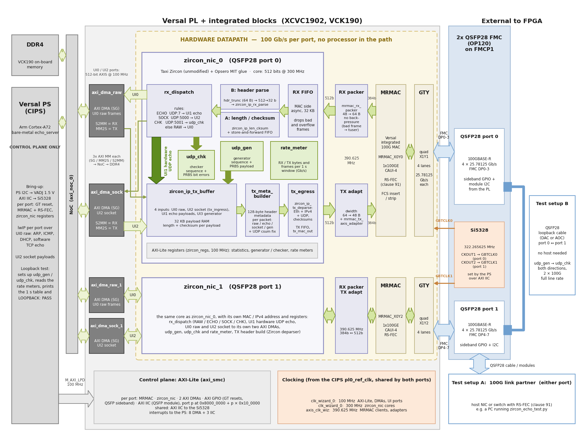

# 100G Zircon IP Stack Reference Design for 2x QSFP28 FMC

## Description

This project demonstrates two 100 Gigabit Ethernet ports on the Opsero [2x QSFP28 FMC] (OP120),
each driven by a Versal integrated 100G Multirate Ethernet MAC (MRMAC, CAUI-4, RS-FEC) and its own
copy of the open-source **Zircon IP stack** from the [Taxi] transport library (FPGA Ninja). Behind
each MAC, Zircon parses and builds Ethernet/IPv4/UDP headers in hardware.

A second target, **KCU116**, runs the same Zircon datapath on one port (QSFP28 port 0: the KCU116
HPC connector wires the lanes of one port only). There, the MAC is the Kintex UltraScale+
XCKU5P's integrated 100G CMAC with RS-FEC, used through Taxi's own 100G CMAC wrapper and a small
MIT shim that also provides the latency timestamps, and the control plane is a MicroBlaze. The
KCU116 build needs only the free Vivado Standard edition (plus AMD's no-charge CMAC license) and
boots from the board's QSPI flash.

**Full 100 Gb/s line rate, in both directions, with UDP payloads of 726 bytes and up.** Below
that, the header path sets the packet rate: about **16.7 million packets per second on transmit
and 18.75 million on receive**, per port, because Zircon's 32-bit header parser and deparser
spend about 16 to 18 cycles of the 300 MHz core clock on each packet. That is roughly two orders
of magnitude more packets per second than a software network stack on one processor core
handles, and no processor touches the packets
on these hardware paths. See [Performance](#performance) for the
measured numbers.

**There is no processor in the datapath.** The datagrams that the hardware UDP echo answers, and
those that the traffic generator sends and the checker verifies, never reach the Versal PS; for
the hardware UDP socket, the headers are also parsed and built in logic. Separately, each port
has two AXI DMAs to the PS: a control-plane and raw path, used to configure and observe the
design, that carries ARP, ICMP, DHCP, the software TCP echo (for comparison) and the socket
payloads. The PS runs a bare-metal bring-up and control application: it powers the FMC (VADJ),
programs the Si5328 GT reference clocks, brings up both MRMACs with RS-FEC, sets up the Zircon
registers and runs a control-plane lwIP stack on the raw path of each port. On each port, the
received traffic is split three ways:

* **UI1 hardware UDP echo** (the headline demonstration): IPv4/UDP datagrams to the echo port
  (default 7) are sent back by the hardware, with the headers swapped and rebuilt and the checksums
  inserted. The PS never sees them.
* **UI2 hardware UDP socket**: a connected UDP socket in hardware. Received datagrams on the socket
  port (default 5000) reach the PS payload-only, behind a 64-byte descriptor, through an AXI DMA;
  payloads written by the PS get their Ethernet/IPv4/UDP headers built by the hardware.
* **UI0 raw** (control plane): complete Ethernet frames to and from the PS through a second AXI
  DMA, for everything the hardware rules do not claim (ARP, ICMP, DHCP, TCP), handled by lwIP.

Each port also has a **hardware UDP traffic generator and checker** and per-second **rate
meters**. The generator sends datagrams at up to 100 Gb/s line rate, each with a sequence number
and a pseudo-random payload; the checker verifies every datagram sent to UDP port 5001 and
counts lost datagrams and payload bit errors.

Each port also **measures its own latency** with the MRMAC's IEEE 1588 timestamps: from the
start of a request at the receive PCS to the start of the reply at the transmit PCS, for every
hardware UDP echo and every software TCP echo, with count, minimum, mean, maximum, standard
deviation and a 64-bin histogram kept in hardware.

The design can be tested in three ways:

* **With a QSFP28 cable between port 0 and port 1 — no host needed.** Each port's generator
  sends to the other port's checker, at the full 100 Gb/s line rate in both directions. The
  application starts the test by itself when it sees the two ports cabled together and prints
  `LOOPBACK: PASS` on the UART. A second test sends port 0's generator through port 1's hardware
  UDP echo and back, and measures the echo latency at line rate.
* **With a QSFP28 loopback plug** in one port: that port's generator sends to its own checker.
* **With a host that has a 100G NIC**, on port 0 or port 1: the host-side script
  `scripts/zircon_echo_test.py` tests the hardware echo, the hardware socket and the software TCP
  echo, and with `--latency` puts the board's latency figures next to the host's round trips.

The block design (`Vivado/src/bd/bd_versal.tcl`) contains, for each of the two ports:

* **MRMAC**: MRMAC_X0Y0 (port 0) or MRMAC_X0Y2 (port 1), 1x100GE CAUI-4 on four GTY lanes (FMC
  DP0-3 or DP4-7), **RS-FEC** (clause 91, RS(528,514)), 384-bit client interface at 390.625 MHz.
  The GT reference clocks (322.265625 MHz) come from the FMC's Si5328, which software programs at
  boot.
* **`zircon_nic`**: a block-design module reference holding the Zircon modules (unmodified, from the
  `submodules/taxi` submodule) and Opsero's MIT glue: a header truncator that lets the 32-bit Zircon
  parser keep up with 100G, rule matching and dispatch, the socket descriptor, the TX header
  metadata builder, the UDP generator and checker, the rate meters, the latency measurement, an
  AXI-Lite register file and statistics counters. The core runs 512 bits wide at 300 MHz; an RX packer and an AMD width
  converter go between the MRMAC's 48-byte and Zircon's 64-byte streams.
* **Two AXI DMAs** (scatter-gather, 512-bit streams at 100 MHz) for the raw and socket paths, reaching
  DDR4 through the NoC.
* **Control**: the CIPS `M_AXI_LPD` reaches the MRMAC, the DMAs, zircon_nic, and the QSFP sideband
  GPIO and I2C of each port (port *p* at `0x8000_0000 + p × 0x10_0000`), and the shared Si5328 I2C.

The KCU116 block design (`Vivado/src/bd/bd_microblaze.tcl`) has the same `zircon_nic` and DMAs for
port 0, with the CMAC (CMACE4_X0Y0, GTY bank 227) inside the `zircon_cmac_us` module reference in
place of the MRMAC, a MicroBlaze with 256 KB of local memory and 1 GB of DDR4, and a UART Lite
console. RS-FEC is fixed on there, and its latency figures (taken at the CMAC client interface)
are not directly comparable with the VCK190's.

**Status: two ports on the VCK190 and one port on the KCU116, bare-metal only** (no Linux image).
Zircon is under active development upstream; this design pins Taxi at `cc70b27` and works around a
UDP checksum issue of its deparser (see the docs).



Important links:

* The user guide for this reference design is hosted here: [2x QSFP28 FMC Zircon Ethernet docs](https://qsfp28-zircon.ethernetfmc.com "2x QSFP28 FMC Zircon Ethernet docs")
* Datasheet of the [2x QSFP28 FMC]
* The open-source IP stack: [Taxi transport library](https://github.com/fpganinja/taxi "Taxi transport library")
* To report a bug: [Report an issue](https://github.com/fpgadeveloper/qsfp28-fmc-zircon/issues "Report an issue").
* For technical support: [Contact Opsero](https://opsero.com/contact-us "Contact Opsero").
* To purchase the mezzanine card: [2x QSFP28 FMC order page](https://opsero.com/product/2x-qsfp28-fmc "2x QSFP28 FMC order page").

## Performance

Measured on the VCK190 with the built-in loopback test: an optical QSFP28 cable
from port 0 to port 1, each port's hardware generator sending to the other port's hardware
checker, both directions at once. The numbers are the same for both directions.

| UDP payload | Line rate | Packets per second | Errors |
|-------------|-----------|--------------------|--------|
| 64 B        | 17.33 Gb/s  | 16,666,499 | 0 |
| 128 B       | 25.86 Gb/s  | 16,666,498 | 0 |
| 256 B       | 42.93 Gb/s  | 16,666,499 | 0 |
| 512 B       | 77.06 Gb/s  | 16,666,499 | 0 |
| 726 B       | 100.00 Gb/s | 15,782,812 | 0 |
| 1024 B      | 100.00 Gb/s | 11,467,878 | 0 |
| 1472 B      | 100.00 Gb/s | 8,127,432  | 0 |
| 1500 B      | 100.00 Gb/s | 7,982,114  | 0 |
| 9000 B      | 100.00 Gb/s | 1,378,777  | 0 |

Line rate includes the FCS, preamble and inter-packet gap (100 Gb/s maximum). Errors are the
checker's lost, bit-error and length-error counts. The payload rates, the method and the UART
output are in the docs:
[Measured throughput](docs/source/description.md#measured-throughput).

**Latency (MRMAC 1588 timestamps, RX PCS to TX PCS on the board):**

* The hardware UDP echo takes about 0.49 µs at 64 B, 0.83 µs at 1472 B and 2.99 µs at 9000 B
  (mean), with a standard deviation of 1 to 4 ns, even at 100 Gb/s line rate.
* The software TCP echo (lwIP on the Cortex-A72) takes 6.8 µs at 64 B to 9.7 µs at 1460 B (mean).

Seen from a host with a 100G NIC, the round trip is about 30 to 47 µs (mean), mostly the host's
own network stack. See
[Latency measurement](docs/source/testing.md#latency-measurement).

**KCU116** (port 0 to a 100G host): all host tests pass, 12 million 1472-byte hardware echoes with
no loss, generator and checker against the host with no errors, boot from QSPI. The hardware UDP
echo takes 385 ns at 64 B and 718 ns at 1472 B (mean, CMAC client to CMAC client); the software
TCP echo on the 100 MHz MicroBlaze takes 93 µs to 0.5 ms. See
[KCU116 results](docs/source/testing.md#kcu116-port-0-microblaze-v130).

## Requirements

This project is designed for version 2025.2 of the AMD tools (Vivado/Vitis).
If you are using an older version of the tools, then refer to the
[release tags](https://github.com/fpgadeveloper/qsfp28-fmc-zircon/tags "releases")
to find the version of this repository that matches your version of the tools.

In order to test this design on hardware, you will need the following:

* Vivado 2025.2: for the VCK190, the **Enterprise** edition (the XCVC1902 device) with the no-cost
  **MRMAC license**; for the KCU116, the free **Standard** edition with the no-cost **CMAC license**
* Vitis 2025.2
* [2x QSFP28 FMC]
* One of the target platforms listed below
* For the loopback test (VCK190): one QSFP28 100G cable (DAC, AOC or a pair of optical modules with
  a fibre) between port 0 and port 1 of the card — nothing else; or a QSFP28 loopback plug for one
  port
* For the host test: a 100G link partner with RS-FEC (clause 91), e.g. a 100G NIC in FEC "auto"
  mode, a QSFP28 cable or modules, and a Linux PC with Python 3 on the 100G link to run
  `scripts/zircon_echo_test.py`

## Target designs

This repo contains designs that target the supported development boards and their
FMC connectors. The table below lists the target design name, the QSFP28 ports and FEC mode of the
design, the FMC connector on which to connect the mezzanine card and whether the standalone
application is built for it (the design has no Linux flow).

<!-- updater start -->
### Versal designs

| Target board          | Target design      | Ports       | FEC         | FMC Slot(s) | Standalone<br> Echo Server | Vivado<br> Edition |
|-----------------------|--------------------|-------------|-------------|-------------|-------|-------|
| [VCK190]              | `vck190_fmcp1`     | 2x 100G     | RS-FEC (CL91) | FMCP1       | :white_check_mark: | Enterprise |

### FPGA designs

| Target board          | Target design      | Ports       | FEC         | FMC Slot(s) | Standalone<br> Echo Server | Vivado<br> Edition |
|-----------------------|--------------------|-------------|-------------|-------------|-------|-------|
| [KCU116]              | `kcu116`           | 1x 100G     | RS-FEC (CL91) | HPC         | :white_check_mark: | Standard :free: |

[VCK190]: https://www.xilinx.com/vck190
[KCU116]: https://www.xilinx.com/kcu116
<!-- updater end -->

Notes:

1. The Vivado Edition column indicates which designs are supported by the Vivado *Standard* Edition, the
   FREE edition which can be used without a license. Vivado *Enterprise* Edition requires
   a license however a 30-day evaluation license is available from the AMD Xilinx Licensing site.

## Software

The design is **bare-metal only**: one standalone application, built with Vitis. There is no
Linux (PetaLinux or Yocto) flow.

| Environment | Build flow   | Application |
|-------------|--------------|-------------|
| Standalone  | Vitis        | `echo_server`: bring-up and control of both ports (VADJ, Si5328, MRMAC + RS-FEC, zircon_nic registers); hardware UDP echo on port 7; hardware UDP socket demo on port 5000; control-plane lwIP on the raw path (DHCP with a static fallback, ping, software TCP echo on port 7); the loopback tests with the hardware generators and checkers (port 0 ↔ port 1, through the hardware echo, or one port on a loopback plug; `LOOPBACK: PASS`); latency statistics on the UART (`T`) and on UDP port 5002; live counters on the UART |

The VCK190 is loaded with the resulting `BOOT.BIN`, from a microSD card or over JTAG; the KCU116
with `zircon_boot.bit` (the bitstream with the application embedded) over JTAG, or from its QSPI
flash with `zircon_boot.mcs`. With a
loopback cable between the two ports, the application tests itself and prints `LOOPBACK: PASS`
or `LOOPBACK: FAIL` on the UART. With a host instead, the host-side judge
`scripts/zircon_echo_test.py` tests all three services of a port from a Linux PC on the 100G link
and prints `VERDICT: PASS` or `VERDICT: FAIL`; with `--latency` it also checks the latency
measurement.

## Licensing

Everything that Opsero wrote in this repository — the zircon_nic glue logic (including the traffic
generator, checker and latency measurement) and register file, the
block design, constraints, software and build scripts — is released under the **MIT license** (see
`LICENSE`). The Taxi transport library, including the Zircon
IP stack, is brought in as a git submodule (`submodules/taxi`) and is licensed under the
**CERN-OHL-S-2.0** (strongly reciprocal) or, alternatively, a commercial license from FPGA Ninja.
CERN-OHL-S has consequences for products that ship a bitstream built from this design: read
[`submodules/README.md`](submodules/README.md) before you build one.

## Build instructions

Clone the repo **with its submodules** and change into its directory:
```
git clone --recursive https://github.com/fpgadeveloper/qsfp28-fmc-zircon.git
cd qsfp28-fmc-zircon
```
If you already have a clone without the submodule, run `git submodule update --init` — the
Vivado build cannot find the Zircon and Taxi sources without it.

To build everything for the VCK190 (Vivado project, then the bare-metal echo server and its
`BOOT.BIN`) and gather the boot files into `bootimages/`, run (on Windows or Linux):
```
./build.sh all --target vck190_fmcp1
```

For the KCU116, the same command with `--target kcu116` builds the bitstream, the echo server and
the QSPI flash image (`Vitis/boot/kcu116/zircon_boot.bit` and `zircon_boot.mcs`); program the
`.mcs` into the board's MT25QU01G flash (`mt25qu01g-spi-x1_x2_x4` in the Vivado Hardware Manager)
to boot the design at power-on.

### Cross-platform build runner

All builds are driven by `build.py` at the repo root, on both Windows
(git bash) and Linux. The `build.sh` / `build.bat` shim finds a suitable
Python 3 automatically (including the one bundled with the AMD tools).
Pick a target design label from the tables above (or run `./build.sh
list`), then run the build command for the stage(s) you want — each
command builds whatever it depends on automatically and skips anything
already built. On Windows without git bash, run the same commands from
Command Prompt or PowerShell using `build.bat` (e.g. `build.bat xsa
--target <target>`).

You don't need to source the AMD tools first — the build runner finds
Vivado and Vitis automatically in their standard install
locations and sets up the environment each stage needs. If your tools
are installed somewhere non-standard and the runner can't find them,
source the tool settings yourself before running the build.

This repository uses git submodules. Clone it with `--recursive`, or run
`git submodule update --init` in an existing clone, before building —
the Vivado build fails without the submodule sources.

#### Build the Vivado project (bitstream + XSA)

```
./build.sh xsa --target <target>
```

#### Build the standalone application

Builds the Vitis workspace and the baremetal boot file (`BOOT.BIN` or
bit file, depending on the device family):

```
./build.sh standalone --target <target>
```

#### Build everything

Builds all of the above that the target supports, then gathers the boot
images into `bootimages/*.zip`:

```
./build.sh all --target <target>
./build.sh all --target all          # every target in the repo
```

Also available: `status`, `clean`, `project` — see
`./build.sh --help`.

## Contribute

We strongly encourage community contribution to these projects. Please make a pull request if you
would like to share your work:
* if you've spotted and fixed any issues
* if you've added designs for other target platforms

Thank you to everyone who supports us!

## About us

This project was developed by [Opsero Inc.](https://opsero.com "Opsero Inc."),
a tight-knit team of FPGA experts delivering FPGA products and design services to start-ups and tech companies.
Follow our blog, [FPGA Developer](https://www.fpgadeveloper.com "FPGA Developer"), for news, tutorials and
updates on the awesome projects we work on.

[2x QSFP28 FMC]: https://docs.opsero.com/op120/datasheet/overview/
[Taxi]: https://github.com/fpganinja/taxi
