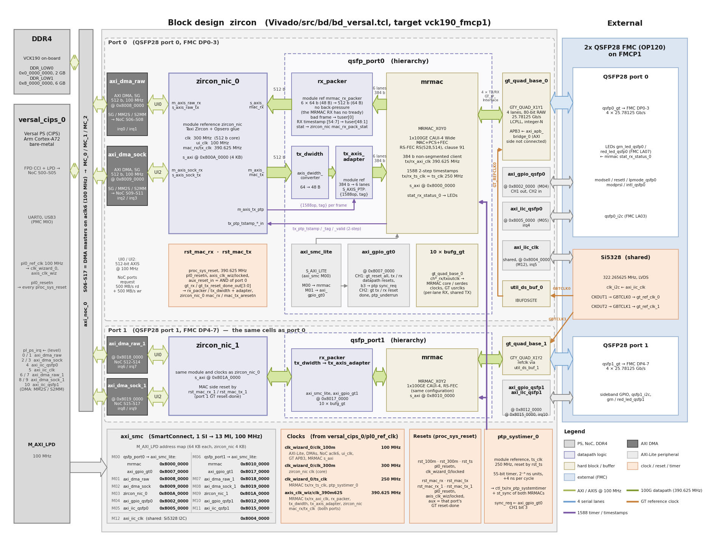

# Hardware design

The design has two block designs, both named `zircon`, one per device family:

| target | block design | MAC | processor |
|---|---|---|---|
| `vck190_fmcp1` (VCK190, FMCP1, QSFP ports 0 and 1) | `Vivado/src/bd/bd_versal.tcl` | Versal MRMAC, one per port | Versal PS |
| `kcu116` (KCU116, HPC, QSFP port 0) | `Vivado/src/bd/bd_microblaze.tcl` | UltraScale+ CMAC through Taxi's 100G wrapper, in the `zircon_cmac_us` shim | MicroBlaze |

`zircon_nic` and its [registers](registers.md) are the same on both. Most of this page describes
the VCK190 design; the KCU116 design is described in [KCU116 block design](#kcu116-block-design)
at the end.

On the VCK190, `bd_versal.tcl` loops over the `ports` of `config/data.json` (1 or 2); port 1 is an exact copy
of port 0 on its own GT quad, MRMAC site, FMC lanes and reference clock, with its own
`zircon_nic_1` and DMAs.

## Block diagram

The diagram shows the cells of the block design as `bd_versal.tcl` creates them: port 0 in
full, port 1 (the same cells with a `1` / `_1` suffix) compact, and the shared clocking, resets,
1588 timer and AXI-Lite tree with the `M_AXI_LPD` base addresses. For the conceptual view of the
data paths (the dispatch rules, UI1 hardware echo, generator and checker inside `zircon_nic`), see
the block diagram on the [description](description.md) page.

## Clocks

| clock | source | frequency | used by |
|---|---|---|---|
| `clk_wizard_0/clk_100m` | CIPS `pl0_ref_clk` (100 MHz) | 100 MHz | AXI-Lite (M_AXI_LPD, SmartConnects), all four AXI DMAs (lite, SG, MM2S, S2MM), NoC `aclk6`, both zircon_nic `ui_clk`, GT APB3, MRMAC `s_axi_aclk` |
| `clk_wizard_0/clk_300m` | CIPS `pl0_ref_clk` | 300 MHz | both zircon_nic `clk` (Zircon core) |
| `clk_wizard_0/ts_clk` | CIPS `pl0_ref_clk` | 250 MHz | both MRMACs' `tx_ts_clk`/`rx_ts_clk` (1588 timestamp clock), `ptp_systimer_0` |
| `axis_clk_wiz/clk_390m625` | CIPS `pl0_ref_clk` | 390.625 MHz | both ports: MRMAC `tx_axi_clk`/`rx_axi_clk`, `rx_packer`, TX adapter and width converter, zircon_nic `mac_rx_clk`/`mac_tx_clk` (one clock shared by both ports, as in 2x-qsfp28-fmc) |
| GT `ch*_rxoutclk`/`ch0_txoutclk` via BUFG_GT | each port's GT quad (322.265625 MHz refclk) | 644.53 / 322.27 MHz | that port's MRMAC core/serdes clocks, GT usrclks (per-lane RX, shared TX, 10 BUFG_GT per port, as 2x-qsfp28-fmc) |

## Resets

| reset | proc_sys_reset | inputs | drives |
|---|---|---|---|
| 100 MHz | `rst_100m` | `pl0_resetn`, `clk_wizard_0/locked` | AXI-Lite peripherals, DMAs, zircon_nic `ui_aresetn`, GT APB, MRMAC `s_axi_aresetn`, `rx_flexif_reset` |
| 300 MHz | `rst_300m` | `pl0_resetn`, `clk_wizard_0/locked` | zircon_nic `aresetn` |
| 250 MHz | `rst_ts` | `pl0_resetn`, `clk_wizard_0/locked` | `ptp_systimer_0` `ts_aresetn` |
| 390.625 MHz RX, port 0 | `rst_mac_rx` | `pl0_resetn`, `axis_clk_wiz/locked`, aux = AND(port 0 `gt_rx_reset_done_out[3:0]`) | `qsfp_port0/rx_packer`, zircon_nic_0 `mac_rx_aresetn` |
| 390.625 MHz TX, port 0 | `rst_mac_tx` | `pl0_resetn`, `axis_clk_wiz/locked`, aux = AND(port 0 `gt_tx_reset_done_out[3:0]`) | `qsfp_port0/tx_dwidth`, zircon_nic_0 `mac_tx_aresetn` |
| 390.625 MHz RX, port 1 | `rst_mac_rx_1` | as port 0, with port 1's GT RX reset-done | `qsfp_port1/rx_packer`, zircon_nic_1 `mac_rx_aresetn` |
| 390.625 MHz TX, port 1 | `rst_mac_tx_1` | as port 0, with port 1's GT TX reset-done | `qsfp_port1/tx_dwidth`, zircon_nic_1 `mac_tx_aresetn` |

The MRMAC's own `rx/tx_core_reset` and `rx/tx_serdes_reset` are `~gt_{rx,tx}_reset_done_out`
(unchanged from 2x-qsfp28-fmc). A GT reset issued through the GT-control GPIO therefore also
resets the MAC side of that port's zircon_nic (its MAC-side FIFOs flush); the ports are
independent.

## Address map (CIPS `M_AXI_LPD`)

Port 0 has the same map as in a one-port build; port 1 repeats port 0's layout at +0x10_0000, so a
port's block is at `0x8000_0000 + p * 0x10_0000 + offset` (port 1's +0x4_0000 slot is
empty because the Si5328 I2C is shared).

| base | size | cell | function | xparameters name |
|---|---|---|---|---|
| `0x8000_0000` | 64 KB | `qsfp_port0/mrmac` | port 0 MRMAC registers | `XPAR_QSFP_PORT0_MRMAC_BASEADDR` |
| `0x8002_0000` | 64 KB | `axi_gpio_qsfp0` | QSFP0 sideband GPIO | `XPAR_AXI_GPIO_QSFP0_BASEADDR` |
| `0x8004_0000` | 64 KB | `axi_iic_clk` | AXI IIC, FMC Si5328 bus (no mux), shared | `XPAR_AXI_IIC_CLK_BASEADDR` |
| `0x8005_0000` | 64 KB | `axi_iic_qsfp0` | AXI IIC, QSFP0 module management | `XPAR_AXI_IIC_QSFP0_BASEADDR` |
| `0x8007_0000` | 64 KB | `qsfp_port0/axi_gpio_gt0` | port 0 GT-control GPIO | `XPAR_QSFP_PORT0_AXI_GPIO_GT0_BASEADDR` |
| `0x8008_0000` | 64 KB | `axi_dma_raw` | port 0 AXI DMA, UI0 raw frames | `XPAR_AXI_DMA_RAW_BASEADDR` |
| `0x8009_0000` | 64 KB | `axi_dma_sock` | port 0 AXI DMA, UI2 hardware UDP socket | `XPAR_AXI_DMA_SOCK_BASEADDR` |
| `0x800A_0000` | 4 KB | `zircon_nic_0` | port 0 zircon_nic registers (DESIGN_SPEC §3.3) | `XPAR_ZIRCON_NIC_0_BASEADDR` |
| `0x8010_0000` | 64 KB | `qsfp_port1/mrmac` | port 1 MRMAC registers | `XPAR_QSFP_PORT1_MRMAC_BASEADDR` |
| `0x8012_0000` | 64 KB | `axi_gpio_qsfp1` | QSFP1 sideband GPIO | `XPAR_AXI_GPIO_QSFP1_BASEADDR` |
| `0x8015_0000` | 64 KB | `axi_iic_qsfp1` | AXI IIC, QSFP1 module management | `XPAR_AXI_IIC_QSFP1_BASEADDR` |
| `0x8017_0000` | 64 KB | `qsfp_port1/axi_gpio_gt1` | port 1 GT-control GPIO | `XPAR_QSFP_PORT1_AXI_GPIO_GT1_BASEADDR` |
| `0x8018_0000` | 64 KB | `axi_dma_raw_1` | port 1 AXI DMA, UI0 raw frames | `XPAR_AXI_DMA_RAW_1_BASEADDR` |
| `0x8019_0000` | 64 KB | `axi_dma_sock_1` | port 1 AXI DMA, UI2 hardware UDP socket | `XPAR_AXI_DMA_SOCK_1_BASEADDR` |
| `0x801A_0000` | 4 KB | `zircon_nic_1` | port 1 zircon_nic registers | `XPAR_ZIRCON_NIC_1_BASEADDR` |

Port 0's MRMAC, GPIO and IIC addresses are the ones the 2x-qsfp28-fmc design uses for
port 0 (its port 1 addresses differ: that design packs port 1 into the gaps). Each port's
MRMAC is a single-port (1x100GE) instance, so its port 0 register page (offset 0x000) is
the one in use. Each GT quad's APB3 port is driven by an `axi_apb_bridge_
` whose AXI side
is not connected (as in 2x-qsfp28-fmc): the GT DRP is not software accessible.

DMA masters (SG, MM2S, S2MM of all four DMAs, 64-bit addresses) see DDR through the NoC:
`0x0_0000_0000` (2 GB, DDR_LOW0) and `0x8_0000_0000` (6 GB, DDR_LOW1).
NoC slave ports (all on `aclk6` = 100 MHz): S06/S07/S08 = `axi_dma_raw` SG/MM2S/S2MM,
S09/S10/S11 = `axi_dma_sock`, S12/S13/S14 = `axi_dma_raw_1`, S15/S16/S17 = `axi_dma_sock_1`;
SG/MM2S/S2MM go to memory-controller ports MC_0/MC_1/MC_2 respectively (the 2x-qsfp28-fmc
pattern, where both ports' MCDMAs share MC_0..2 and the NoC arbitrates), each connection
requesting 500 MB/s read + 500 MB/s write.

## Interrupts

Port 0's assignment is the same as in a one-port build; port 1's is appended. The bare-metal
application is polled and does not enable any of them.

| CIPS pin | GIC SPI | GIC ID | source |
|---|---|---|---|
| `pl_ps_irq0` | 84 | 116 | `axi_dma_raw` MM2S (`mm2s_introut`) |
| `pl_ps_irq1` | 85 | 117 | `axi_dma_raw` S2MM (`s2mm_introut`) |
| `pl_ps_irq2` | 86 | 118 | `axi_dma_sock` MM2S |
| `pl_ps_irq3` | 87 | 119 | `axi_dma_sock` S2MM |
| `pl_ps_irq4` | 88 | 120 | `axi_iic_qsfp0` |
| `pl_ps_irq5` | 89 | 121 | `axi_iic_clk` (Si5328) |
| `pl_ps_irq6` | 90 | 122 | `axi_dma_raw_1` MM2S |
| `pl_ps_irq7` | 91 | 123 | `axi_dma_raw_1` S2MM |
| `pl_ps_irq8` | 92 | 124 | `axi_dma_sock_1` MM2S |
| `pl_ps_irq9` | 93 | 125 | `axi_dma_sock_1` S2MM |
| `pl_ps_irq10` | 94 | 126 | `axi_iic_qsfp1` |

`pl_ps_irq<n>` is SPI 84+n on Versal (2x-qsfp28-fmc uses SPI 84/85 for pl_ps_irq0/1). All are
level, active high. The MRMACs and zircon_nics have no interrupt outputs.

## AXI DMA configuration (all four instances)

Scatter-gather, no status/control stream (`c_sg_include_stscntrl_strm 0`), MM2S and S2MM,
512-bit memory-map and stream widths, 64-bit addressing, 26-bit buffer length (64 MB per BD),
DRE (unaligned transfers) on both channels, max burst 64 beats (= 4 KB at 512 bits; the IP
offers no larger burst at this width), all clocks 100 MHz. Throughput limit: 51.2 Gb/s per
direction per DMA.

## MRMAC configuration (both ports)

| property | value | vs 2x-qsfp28-fmc |
|---|---|---|
| `MRMAC_PRESET_C0` | 1x100GE CAUI-4 Wide | same |
| `MRMAC_MODE_C0` | **MAC+PCS+FEC** | was MAC+PCS |
| `FEC_SLICE0_CFG_C0` | **100G (IEEE 802.3) - RS(528 514)** (clause 91) | was FEC Disabled (Bypass) |
| `FEC_SLICE1..3_CFG_C0` | N/A (follows from the above) | was FEC Disabled (Bypass) |
| `MRMAC_DATA_PATH_INTERFACE_PORT0_C0` | Independent 384b Non-Segmented | same |
| `MRMAC_LOCATION_C0` | MRMAC_X0Y0 (port 0), MRMAC_X0Y2 (port 1) | same |
| `MRMAC_IS_GT_WIZ_OLD` | 1 | same |
| `GT_REF_CLK_FREQ_C0`, `GT_CHn_{RX,TX}_REFCLK_FREQUENCY_C0` | 322.265625 | same |
| `MAC_PORT0_{TX,RX}_FLOW_C0` | 0 (no pause/PFC) | same |
| `MAC_PORT0_ENABLE_AN_LT_C0` | 0 | same |
| `MAC_PORT0_ENABLE_TIME_STAMPING_C0` | **1** | was 0 |
| `PORT0_1588v2_Operation_MODE_C0` | **2-step** | was No operation |
| `TIMESTAMP_CLK_PERIOD_NS` | 4.0 (250 MHz `ts_clk`) | default |

FCS insertion (TX) and stripping (RX) are run-time settings (`CONFIG_TX.INS_FCS`,
`CONFIG_RX.DEL_FCS`), programmed by software as in 2x-qsfp28-fmc. The data path is set up
with `fec: "rs"` in `config/data.json`; `fec: "none"` rebuilds the 2x-qsfp28-fmc MAC+PCS
configuration.

## RX packer and error flag (tuser)

`qsfp_port
/rx_packer` (`Vivado/src/hdl/mrmac_rx_packer.v`, MIT) takes the MRMAC's six 64-bit
RX lanes (`rx_axis_tdata0..5`, `rx_axis_tkeep_user0..5`, `rx_axis_tlast_0`,
`rx_axis_tvalid_0`) and produces zircon_nic's 512-bit `s_axis_mac_rx`. The MRMAC RX client has
no back-pressure, so the packer accepts a beat every cycle unconditionally: a small
accumulator packs the 48-byte beats into 64-byte beats (one output per 64 bytes; on the last
beat of a frame one beat, or a full beat plus a flush beat), and a 16-entry FIFO takes the rare
cycle with two outputs. The MRMAC reports a bad frame (FCS error, runt, etc.) with
`rx_axis_tkeep_user<n>[8]` on the TLAST beat; the packer ORs bit 8 of the lanes that carry
bytes (and only on a valid beat) and puts it on `tuser[0]` of the frame's last 512-bit beat
(Taxi "bad frame"), which zircon_nic's MAC-side FIFO uses to drop the frame. `rx_packer/stat`
(stall / overflow pulses) drives zircon_nic `mac_rx_pack_stat` → `STATUS` bits 4 and 5.

The receive side does not use an AMD `axis_dwidth_converter` (48→64 bytes), as the first
version of the design did. That converter lowers its `S_AXIS_TREADY` for a cycle when the beat
after a TLAST beat and the one after it are both valid, and the MRMAC cannot hold a beat back:
on the bench about 1 in 10,000 back-to-back small datagrams arrived as a frame cut at 48 bytes
merged with the next one. On TX the converter stays (`tx_dwidth` 64→48 bytes +
`mrmac_tx_axis_adapter`), because the MRMAC TX client does back-pressure; zircon_nic's TX
`tuser[0]` (always 0) is not carried and the MRMAC TX Err bits are tied 0.

## QSFP sideband and LEDs (per port)

`axi_gpio_qsfp
` CH1 (outputs, reset value 0x2): bit0 ModSelL, bit1 ResetL (high = out of
reset), bit2 LPMode. CH2 (inputs): bit0 ModPrsL, bit1 IntL. LEDs: `grn_led_qsfp
` =
that port's MRMAC `stat_rx_status_0` (RX aligned), `red_led_qsfp
` = its inverse.

GT-control GPIO `qsfp_port
/axi_gpio_gt
`: CH1 (5 outputs) bit0 gt_reset_all, bit1
gt_reset_tx_datapath, bit2 gt_reset_rx_datapath (each to all four lanes), bit3 (port 0's
GPIO only) `ptp_systimer_0` `sync_req`, bit4 spare; CH2 (3 inputs) bit0 gt_tx_reset_done
(lane 0), bit1 gt_rx_reset_done (lane 0), bit2 `tx_axis_adapter` `ptp_underrun`.

## Si5328 and port 1's reference clock

Port 1's GT refclk is GBTCLK1 = Si5328 CKOUT2 (port 0: GBTCLK0 = CKOUT1), both 322.265625 MHz
LVDS from the one Si5328 on `axi_iic_clk`. The bare-metal table in `Vitis/common/src/si5328.c`
(unchanged from 2x-qsfp28-fmc) already enables CKOUT2: reg 6 = 0x3F (SFOUT2 = SFOUT1 = LVDS),
reg 10 = 0x00 (DSBL_CLKOUT2 = 0) and NC2_LS = 2 (regs 34/35/36 = 0x00/0x00/0x01, the same as
NC1_LS in regs 31-33), then ICAL (reg 136 = 0x40). Nothing more is needed for port 1.

## Latency measurement hardware

Both MRMACs timestamp every frame in IEEE 1588 **2-step** mode against one shared timer;
each zircon_nic computes TX − RX of the frames it echoes (see the
[register map](registers.md#latency-measurement-130) for its `LAT_*` registers). This section is the block-design side: clocks, pins and what software
must program in the MRMAC.

### Timer and timestamp clock

- `ts_clk` = `clk_wizard_0/ts_clk`, 250 MHz. It is the third output of the MMCM that makes
  `clk_100m` / `clk_300m`: VCO 3000 MHz (D = 1, M = 30), dividers 30 / 10 / 12, all at phase 0,
  so the 100 and 300 MHz outputs are exactly as before. The MRMAC IP accepts a timestamp
  clock period of 2.8571–20 ns only, so the 390.625 MHz AXIS clock cannot be used.
- `ptp_systimer_0` (`Vivado/src/hdl/ptp_systimer.v`, one instance on `ts_clk`, reset by
  `rst_ts`) is a free-running 55-bit counter in the MRMAC time unit, **2⁻⁸ ns**, adding
  1024 (= 4 ns) per cycle. It wraps after 2⁴⁷ ns ≈ 39 h, so subtract timestamps modulo 2⁵⁵
  (or modulo 2⁴⁸ for the bits [54:7], in 0.5 ns units, that zircon_nic keeps). The same value drives
  `ctl_tx_ptp_systemtimer_0` and `ctl_rx_ptp_systemtimer_0` of **both** MRMACs, together
  with `st_sync` (a pulse: once, periodically or on `sync_req`; parameters in the RTL
  header), `st_overwrite` (1) and `st_adjust*` (0).
- Clock domains (from the MRMAC primitive's timing arcs): `ctl_*_ptp_systemtimer_0`,
  `_st_sync_0`, `_st_overwrite_0` and `_st_adjust*_0` are on `TX_TS_CLK[0]`/`RX_TS_CLK[0]`
  (= `ts_clk`), so `ptp_systimer` drives them with no CDC. `tx_ptp_1588op_in_0`,
  `tx_ptp_tag_field_in_0` and `tx_ptp_tstamp_*_out_0` are on `TX_AXI_CLK`, and
  `rx_ptp_tstamp_out_0` is on `RX_AXI_CLK` (both = 390.625 MHz `axis_clk`, the domain of the
  adapters and of zircon_nic's MAC side). The MRMAC carries time from `ts_clk` into its AXI
  clock domains itself.
- `sync_req` = `qsfp_port0/axi_gpio_gt0` CH1 bit 3 (asynchronous, synchronised in
  `ptp_systimer`): a 0→1 write forces one extra `st_sync` into both MRMACs.

### Per-port wiring

| from | to | domain | notes |
|---|---|---|---|
| `mrmac/rx_ptp_tstamp_out_0[54:0]` | `rx_packer/rx_ptp_tstamp` | 390.625 MHz | latched at the frame's first beat |
| `rx_packer` `M_AXIS` `tuser[48:0]` | `zircon_nic_
/s_axis_mac_rx` `tuser` | 390.625 MHz | bit 0 = bad frame, [48:1] = RX timestamp bits [54:7] (0.5 ns units), every beat of the frame |
| `zircon_nic_
/m_axis_tx_ptp` (24 b) | `tx_axis_adapter/S_AXIS_PTP` | 390.625 MHz | one record per TX frame: [1:0] 1588op, [17:2] tag |
| `tx_axis_adapter/tx_ptp_1588op_in`, `tx_ptp_tag_field_in` | `mrmac/tx_ptp_1588op_in_0`, `tx_ptp_tag_field_in_0` | 390.625 MHz | held SOP → TLAST; op 2'b10 = 2-step |
| `mrmac/tx_ptp_tstamp_out_0`, `_tag_out_0`, `_valid_out_0` | `zircon_nic_
/tx_ptp_tstamp_in`, `_tag_in`, `_valid_in` | 390.625 MHz | timestamp returned with its tag |
| `tx_axis_adapter/ptp_underrun` | `axi_gpio_gt
` CH2 bit 2 | 390.625 MHz → 100 MHz (GPIO input synchroniser) | sticky until TX reset: a frame had no request record |

MRMAC PTP pins tied to 0: `tx_ptp_cf_offset_in_0`, `tx_ptp_upd_chksum_in_0` (1-step only),
`tx_ptp_flex_1588op_in_0`, `tx_ptp_flex_1588loc_in_0`, `tx_ptp_flex_tag_field_in_0` (FlexE
client only); `tx_ts_clk`/`rx_ts_clk` = `ts_clk` on all four bits. Left open:
`stat_{tx,rx}_ptp_systemtimer_0`, `stat_{tx,rx}_ptp_st_sync_0` (same time readable at
STAT_*_1588_TOD), `{tx,rx}_ptp_rsfec_offset_out_0`, and the ports 1–3 copies of every PTP pin.

### MRMAC registers for software (per MRMAC; port 0 page, offsets from the MRMAC base)

The 1588 settings are runtime registers; the IP configuration only brings the pins out.
Reset values are those of the generated IP (all 0 except SAT_ENABLE).

| offset | register | field | reset | program |
|---|---|---|---|---|
| 0x040 | CONFIGURATION_1588_REG | b0 `CTL_TX_PTP_1STEP_ENABLE` | 0 | leave 0 (2-step) |
| | | b2:1 `CTL_TX_PTP_SAT_ENABLE` | 1 | leave (only affects 1-step correction-field saturation) |
| | | b3 `CTL_TX_PTP_RSFEC_COMP_EN` | 0 | leave 0 for latency: it compensates the TX timestamp for the RS-FEC alignment position (PTP accuracy); constant per link |
| 0x24C | CONFIGURATION_TX_1588_SYSTIMER_CONFIG | [15:0] `CTL_TX_PTP_ST_OFFSET` | 0 | leave 0 |
| 0x250 | CONFIGURATION_TX_1588_TIMESTAMP_CONFIG | [19:0] `CTL_TX_PTP_LATENCY_ADJUST` | 0 | leave 0 (adds a fixed offset to TX timestamps) |
| 0x254 | CONFIGURATION_TX_1588_OFFSET_TABLE_CONFIG | [12:0] `CTL_TX_PTP_BLOCK_PERIOD` | 0 | leave 0 |
| 0x25C | CONFIGURATION_RX_1588_SYSTIMER_CONFIG | [15:0] `CTL_RX_PTP_ST_OFFSET` | 0 | leave 0 |
| 0x260 | CONFIGURATION_RX_1588_TIMESTAMP_CONFIG | [19:0] RX latency adjust | 0 | leave 0 |
| 0x264 | CONFIGURATION_RX_1588_OFFSET_TABLE_CONFIG | [12:0] `CTL_RX_PTP_BLOCK_PERIOD` | 0 | leave 0 |
| 0x268/0x26C | MONITOR_TX_1588_SAMPLE_SYSTIMER LSB/MSB | 55 bits | — | read: last sampled timer |
| 0x270/0x274 | MONITOR_TX_1588_INCR_SYSTIMER LSB/MSB | 50 bits | — | read: derived increment; expect 4 ns per `ts_clk` cycle |
| 0x278–0x284 | MONITOR_RX_1588_{SAMPLE,INCR}_SYSTIMER | | — | RX copies |
| 0x7A8/0x7AC | STAT_TX_1588_TOD LSB/MSB | 55 bits | — | TX timer now; should advance 1 ns per ns |
| 0x7B0/0x7B4 | STAT_RX_1588_TOD LSB/MSB | 55 bits | — | RX timer now |

So with the power-up values nothing has to be written to get 2-step timestamps: 2-step is
selected per frame by `tx_ptp_1588op_in = 2'b10` from the adapter. Every fixed offset
(the latency-adjust registers, RS-FEC compensation, the MRMAC's internal pipeline) is a
constant bias on TX − RX and does not change the histogram shape. The echo server's bring-up
check reads `MONITOR_TX_1588_SAMPLE_SYSTIMER` and `MONITOR_RX_1588_SAMPLE_SYSTIMER` twice, 10 ms
of A72 time apart (after a `TICK_REG` write each time), checks that both advanced by about the
same time (units 2⁻⁸ ns in bits [54:0]) and prints `MONITOR_*_1588_INCR_SYSTIMER`. If the
timer does not run, it pulses GT-control GPIO CH1 bit 3 (`sync_req`) of port 0 and reads again.
It uses the SAMPLE registers rather than `STAT_*_1588_TOD`: on the bench about half of the TOD
read-backs had bit 54 set and some went backwards, while the SAMPLE registers were monotonic;
the frame timestamps are not affected. The IP leaves the hard attribute `CTL_PCS_RX_TS_EN`
FALSE, as AMD's example design does; the RX timestamps are nevertheless valid (isolated
datagrams measure the same latency as back-to-back traffic).

Timestamp reference point: the first PCS block of the frame (PG314 "Timestamping"), so
TX − RX spans RX-PCS SOP to TX-PCS SOP and excludes the serdes, PCS and RS-FEC latency of
both directions.

## KCU116 block design

`Vivado/src/bd/bd_microblaze.tcl`, target `kcu116`: the 2x QSFP28 FMC on the KCU116's HPC
connector, which wires only FMC DP0-3, so **QSFP28 port 0 only** (GTY bank 227, quad X0Y12-15).
The QSFP1 module is held in reset and low-power mode by constants and its LEDs are off. The
XCKU5P has one 100G CMAC (`CMACE4_X0Y0`), which this port uses.

What differs from the VCK190 design:

| | VCK190 | KCU116 |
|---|---|---|
| MAC | Versal MRMAC hard block, configured by software | UltraScale+ CMAC (`cmac_usplus`) inside Taxi's `taxi_eth_mac_100g_us` wrapper, inside the `zircon_cmac_0` module reference |
| FEC | RS(528,514), switchable at run time | RS(528,514), fixed on by the Taxi wrapper; no FEC counters |
| MAC client | 384 bits at 390.625 MHz; RX packer and TX width converter to 512 bits | 512 bits at the CMAC's own `tx_clk` / `rx_clk` (322.265625 MHz); no packer, no converter |
| Timestamps | MRMAC IEEE 1588 2-step, at the PCS | fabric timestamps in the shim, at the MAC client interface ([below](#timestamps-on-the-kcu116)) |
| Processor, memory | Versal PS, DDR4 through the NoC | MicroBlaze at 100 MHz with 32 KB caches and 256 KB of local memory (LMB), 1 GB DDR4 through a MIG |
| Console | PS UART0 | AXI UART Lite, 115200 8N1 |
| FMC VADJ | 1.5 V, set by software | fixed at 1.8 V by the board |
| Boot | `BOOT.BIN` from SD, or JTAG | bitstream with the application embedded (`zircon_boot.bit`) over JTAG, or from QSPI flash (`zircon_boot.mcs`) |

### Clocks

| clock | source | frequency | used by |
|---|---|---|---|
| `sys_clk` | `ddr4_0/addn_ui_clkout1` | 100 MHz | MicroBlaze, AXI peripherals, both AXI DMAs, zircon_nic `ui_clk` |
| `c0_ddr4_ui_clk` | `ddr4_0` (MIG) | 333.25 MHz | DDR side of the memory SmartConnect `axi_smc` only |
| `clk_wiz_0/clk_out1` | MMCM from `sys_clk` (VCO 1500 MHz) | 300 MHz | zircon_nic core, as on the VCK190 |
| `clk_wiz_0/clk_out2` | same MMCM | 250 MHz | the shim's timestamp timebase |
| `clk_wiz_0/clk_out3` | same MMCM | 125 MHz | the shim's control clock: Taxi transceiver control (free-running GT clock, DRP, APB) and the shim's AXI-Lite registers |
| `zircon_cmac_0/tx_clk`, `rx_clk` | the CMAC's GT clocks (TX: TXPROGDIVCLK; RX: lane 0 recovered clock) | 322.265625 MHz | zircon_nic `mac_tx_clk` / `mac_rx_clk` |
| GT reference clock | Si5328 CKOUT1 → GBTCLK0 (pin K7) | 322.265625 MHz | the GTY quad; `IBUFDS_GTE4` inside the shim |

Resets come from one `proc_sys_reset` per clock (`rst_ddr4_0_100M`, `rst_core_300M`,
`rst_ts_250M`, `rst_ctrl_125M`), all released by the board's CPU reset button and the MMCM
lock. zircon_nic's MAC-side resets come from the shim: they are held while the transceivers of
that direction are in reset.

### Address map (MicroBlaze)

| base | size | cell | function |
|---|---|---|---|
| `0x0000_0000` | 256 KB | LMB | local memory: application code, data and stack |
| `0x4000_0000` | 64 KB | `axi_uartlite_0` | console UART |
| `0x41C0_0000` | 64 KB | `axi_timer_0` | `usleep()` / `sleep()` timer (xiltimer) |
| `0x41C1_0000` | 64 KB | `axi_timer_1` | the application's 64-bit timebase |
| `0x4400_0000` | 512 KB | `zircon_cmac_0` | CMAC shim registers (+`0x0_0000`) and transceiver APB (+`0x4_0000`) |
| `0x4408_0000` | 64 KB | `axi_dma_raw` | AXI DMA, UI0 raw frames |
| `0x4409_0000` | 64 KB | `axi_dma_sock` | AXI DMA, UI2 hardware UDP socket |
| `0x440A_0000` | 4 KB | `zircon_nic_0` | zircon_nic registers |
| `0x440B_0000` | 64 KB | `axi_gpio_qsfp0` | QSFP0 sideband GPIO (as on the VCK190) |
| `0x440C_0000` | 64 KB | `axi_iic_qsfp0` | AXI IIC, QSFP0 module management |
| `0x4410_0000` | 64 KB | `axi_iic_clk` | AXI IIC, FMC Si5328 |
| `0x8000_0000` | 1 GB | `ddr4_0` | DDR4 (MicroBlaze cached ports and every DMA master) |

All addresses are fixed in `bd_microblaze.tcl`: `zircon_cmac_0` and `zircon_nic_0` are module
references, which get no `XPAR_` macros, so `hw_config.h` has their addresses as constants.
There are no interrupts; the application polls everything. The AXI DMAs are configured as on the
VCK190 except for 32-bit addressing.

### The CMAC shim (`zircon_cmac_us`)

`zircon_cmac_0` is a module reference (`Vivado/src/hdl/zircon_cmac_us.v`, a Verilog shell over
`zircon_cmac_us_core.sv`, MIT) that wraps Taxi's `taxi_eth_mac_100g_us`, unmodified, and gives
`zircon_nic` the same MAC-side interface it has on the VCK190:

* **Receive:** the CMAC's 512-bit frames, with the CMAC error flag on `tuser[0]` of the last beat
  and the frame's receive timestamp on `tuser[48:1]` of every beat. The CMAC cannot be
  back-pressured, just like the MRMAC.
* **Transmit:** zircon_nic's frames go straight into the wrapper. Each frame's timestamp request
  (tag and operation) waits in a 16-entry FIFO; when the frame starts, the shim returns the
  timestamp with its tag one cycle later.
* **Transceiver control:** Taxi's 16-bit transceiver control bus (APB) is reachable from the
  processor through an AXI-Lite to APB adapter at +`0x4_0000` (lane *n* at +`0x4_0000` + *n* ×
  `0x1_0000`). Use 16-bit accesses; while the transceivers are held in reset the window answers
  with an error instead of hanging. The application does not use it.

Registers (32-bit, byte offsets from `0x4400_0000`):

| offset | name | access | meaning |
|---|---|---|---|
| `0x000` | `ID` | R | `0x434D4143` ("CMAC") |
| `0x004` | `VERSION` | R | `0x00010000` |
| `0x008` | `CTRL` | RW | bit 0 `XCVR_RST` (transceivers and CMAC held in reset), bit 1 `RX_RST`, bit 2 `TX_RST` (CMAC datapath resets, levels), bit 4 `TX_EN`, bit 5 `RX_EN`. Reset value **`0x31`**: the transceivers stay in reset until software has programmed the Si5328 and clears `XCVR_RST` |
| `0x00C` | `STATUS` | R | bit 0 `RX_STATUS` (link up: CMAC receive aligned), bit 1 `RX_BLOCK_LOCK`, bit 2 `RX_HIGH_BER`, bit 3 `TX_RST_OUT`, bit 4 `RX_RST_OUT` (the wrapper's resets), bit 5 `GTPOWERGOOD`, bit 6 `TX_CLK_ALIVE`, bit 7 `RX_CLK_ALIVE` |
| `0x010` | `STICKY` | R / W1C | bit 0 `LINK_LOST`, bit 1 `PTP_UNDERRUN` (a frame was sent without its timestamp request), bit 2 `TS_RECORD_OVF` (a timestamp request arrived while the 16-entry FIFO was full) |
| `0x020` / `0x024` | `TS_NOW_LO` / `_HI` | R | the timestamp timer now (55 bits, 2⁻⁸ ns units); reading `LO` latches `HI` |
| `0x028` | `TS_INCR` | R | 1024 (4 ns per 250 MHz cycle) |
| `0x030` | `RX_GOOD_PKTS` | R | frames the CMAC received without error |
| `0x034` | `RX_BAD_FCS` | R | frames the CMAC received with a bad FCS |
| `0x038` | `RX_ERR_FRAMES` | R | frames delivered with the error flag |
| `0x03C` | `TX_GOOD_PKTS` | R | frames the CMAC sent |
| `0x040` | `TX_FRAMES` | R | frames that entered the shim |
| `0x044` | `TX_TS_RET` | R | transmit timestamps returned |
| `0x048` / `0x04C` | `TX_CLK_KHZ` / `RX_CLK_KHZ` | R | `tx_clk` / `rx_clk` measured in kHz (322265 expected), refreshed every 1 ms |

The counters are 32 bits wide, wrap, and are never reset by hardware; software works with
differences. The full definition is §6c of `docs/DESIGN_SPEC.md`.

What the Taxi wrapper does, at the pinned commit, sets some limits of this target: RS-FEC is
always on, there are no RS-FEC counters, the CMAC maximum frame length is the IP's fixed default
(9046-byte frames, i.e. 9000-byte UDP payloads, verified on the bench; believed to be 9600
bytes), and the wrapper provides no
timestamps, hence the shim's own.

### Timestamps on the KCU116

The shim keeps its own 55-bit timer in the same unit as the VCK190's (2⁻⁸ ns, advancing 4 ns
per 250 MHz cycle) and carries it into the CMAC's clock domains with Gray-code crossings. It
timestamps the first beat of each received frame at the CMAC's client interface and the first
beat of each transmitted frame as it enters the wrapper. `zircon_nic` uses them exactly as it
uses the MRMAC's.

So on the KCU116 the latency runs from the **start of the request at the CMAC client interface
to the start of the reply at the CMAC client interface**. The CMAC's own transmit and receive
pipeline (estimated at 100 to 300 ns in total) is not included, besides the serdes, PCS and
RS-FEC stages the VCK190 figure also leaves out. **The KCU116 figures are therefore lower than
the VCK190's for the same path and cannot be compared with them directly.** Each sample is
quantised to 4 ns and has a few ns of sampling jitter from the clock crossings (estimated at
±4 to 7 ns); the mean is not biased. Measured standard deviation of the hardware echo: 2.3 to
2.8 ns (see [Testing](testing.md#kcu116-port-0-microblaze-v130)).

### Constraints and implementation notes

`Vivado/src/constraints/kcu116.xdc` holds the pin assignments (those of the 2x-qsfp28-fmc
reference design, LVCMOS18), the GT reference clock, and three placement and timing constraints
that the design needs:

* `LOC CMACE4_X0Y0` on the CMAC: Taxi's IP script disables the IP's own location constraint.
* `USER_CLOCK_ROOT X3Y3` on the four per-lane receive clock buffers: the CMAC limits the skew
  between its four receive serdes clocks to 1.0 ns, and lane 0's clock also drives the whole
  receive side of the fabric, whose clock root the placer would otherwise put too far away.
* No `set_clock_groups -asynchronous`: it would override the clock-domain-crossing constraints
  that Taxi's scripts and the shim's `zircon_cmac_us.tcl` apply. Those scripts are processed
  after `kcu116.xdc` (`PROCESSING_ORDER LATE`), because they need the CMAC clocks that it
  creates.

The bitstream settings (compression, 31.9 MHz configuration clock, x4 SPI, 32-bit addressing)
let the FPGA boot from the QSPI flash. The build closes timing with the 300 MHz core clock
(worst slack +0.050 ns) and uses about 42 % of the LUTs and 58 % of the block RAM of the
XCKU5P.
